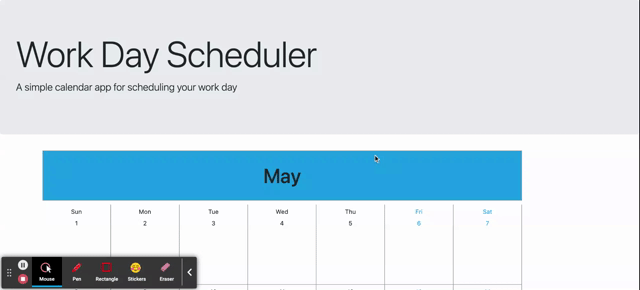

# Employee Calendar 

### Hello All, Organize your day with this beautiful Calendar app made dynamically with JavaScript!

## Some things to consider 

- The starter code is written in vanilla JS, not JQuery
- The starter code does not use moment.js

## Goal Functionality 

Make this Calendar fully funtional.

- To integrate our Hourly Planner into Monthly Calendar: 
  - WHEN a day is selected in the Calendar, our Hourly Planner pops up
  - WHEN a user saves data in the Hourly Planner, a 'Todo' List is displayed at the top of the Calendar with the saved data for that Timeblock
  - WHEN a user looks at the Todo List, Have Edit, Save, and Delete Buttons for Saved Data 
  - WHEN a user completes a Task, Have Completed Task Button Icon ✅ that greys out the Task
  - IF a Task is Uncompleted, Task is added to Next day 

Other ideas are totally welcomed! 

### Starter Code provided by [Jab Joubran](https://youtu.be/krOTeX1DqHI)

